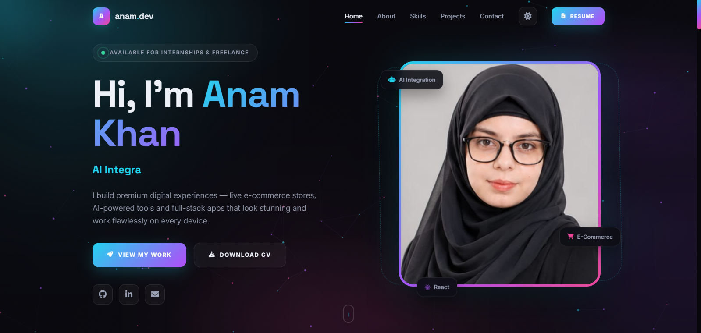
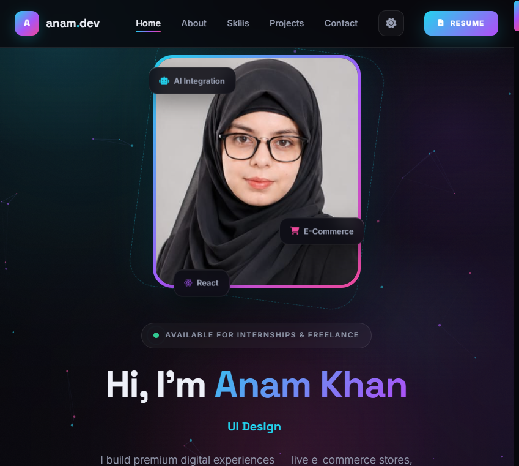
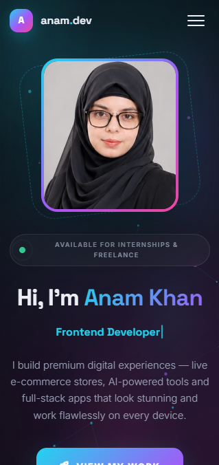

<div align="center">



<br/><br/>

# tsg-webdev-p01-anamkhan

**The Sky Gen - Web Development Program**
*Project 01 / Beginner Level - Personal Portfolio Website*

<br/>

[](https://anamkhan2007.github.io/tsg-webdev-p01-anamkhan)
[](https://github.com/anamkhan2007/tsg-webdev-p01-anamkhan)
[](https://www.linkedin.com/in/anam-khan-9b264541a)

<br/>


</div>

---

## Project Brief

| | |
|---|---|
| **Program** | The Sky Gen - Web Development, September-November 2026 |
| **Project** | Project 01 - Personal Portfolio Website |
| **Level** | Beginner |
| **Ref** | TSG/WD/P01/2026 |
| **Assigned** | 01 September 2026 |
| **Deadline** | 21 September 2026, 11:59 PM PKT |
| **Total Marks** | 100 |
| **Pass Mark** | 60% |
| **Top Tier** | 90%+ - Excellence + Job Offer |

---

## Project Description

A fully handcrafted single-page personal portfolio website built using only **HTML5, CSS3, and vanilla JavaScript** - no page builders, no drag-and-drop tools, no frameworks. Every line of code is written from scratch.

The site presents me as a professional web developer - showcasing my skills, projects, and experience in a clean, responsive, and visually polished format that works perfectly on every screen size from 360px to 1440px+.

> Built to prove: a blank editor can become a live, client-ready website using only the fundamentals.

---

## Live Demo

**URL:** [https://anamkhan2007.github.io/tsg-webdev-p01-anamkhan](https://github.com/anamkhan2007/tsg-webdev-p01-anam.git)

Tested and confirmed working on:
- Mobile (360px, 480px)
- Tablet (768px)
- Desktop (1080px, 1440px)
- Chrome, Firefox, Safari, Edge

---

## Required Features - All Completed

| # | Feature | Status |
|---|---|---|
| 1 | **Navigation bar** - fixed, smooth scroll to all sections | Done |
| 2 | **Hero section** - name, tagline, photo, call-to-action button | Done |
| 3 | **About section** - bio (80-120 words) + downloadable CV button | Done |
| 4 | **Skills section** - 8 skills with icons and progress bars | Done |
| 5 | **Projects section** - 7 project cards with image, title, description, link | Done |
| 6 | **Contact section** - styled form with JS validation + email + social links | Done |
| 7 | **Footer** - copyright line and social icons | Done |
| 8 | **Responsive design** - correct at 360px, 768px and 1440px, no horizontal scroll | Done |
| 9 | **Interactions** - dark/light mode toggle, mobile menu, scroll-reveal, custom cursor | Done |

---

## Tech Stack

| Category | Technology |
|---|---|
| **Structure** | HTML5 - Semantic elements throughout |
| **Styling** | CSS3 - Custom Properties, Flexbox, CSS Grid |
| **Logic** | JavaScript ES6+ - Vanilla, no libraries |
| **Icons** | Font Awesome 6.5.1 |
| **Fonts** | Google Fonts - Inter, Space Grotesk, JetBrains Mono |
| **Email** | EmailJS - contact form integration |
| **Version Control** | Git & GitHub |
| **Deployment** | Netlify / GitHub Pages |

---

## Project Structure

```
tsg-webdev-p01-anamkhan/
|
|- index.html
|- README.md
|
|- css/
|   - style.css
|
|- images/
|   - anam.jpg
|   - og-banner.png
|   - project-anamora.png
|   - project-eduverse.png
|   - project-luxemart.png
|   - project-aurum.jpg
|   - project-alsaudia.png
|   - project-curie.png
|   - project-recipe.png
|
|- assets/
|   - Anam-Khan-Resume.pdf
|
|- screenshots/
    - mobile-360.png
    - tablet-768.png
    - desktop-1440.png
```

---

## Screenshots

### Desktop - 1440px


### Tablet - 768px


### Mobile - 360px


---

## Sections Overview

### 01 - Hero
Name, animated typed tagline, profile photo with floating skill chips, "Download CV" and "Hire Me" CTA buttons.

### 02 - About
80-120 word professional bio, education card (Aptech Learning - Advanced Diploma in Software Engineering), currently learning section, downloadable CV button.

### 03 - Skills
8 tech skills with Font Awesome icons and CSS progress bar indicators:
HTML5/CSS3, JavaScript ES6+, Bootstrap/Tailwind, ASP.NET/C#, MySQL/SQL, Git/GitHub, Figma/UI Design, React (learning)

### 04 - Projects
1 featured project + 6 project cards, each with: screenshot, title, description, tech tags, live demo link and GitHub link.

### 05 - CV
Full curriculum vitae section - education timeline, skills breakdown, downloadable PDF resume.

### 06 - Contact
EmailJS-powered contact form with JS validation (name, email, message fields), social links, email address.

### 07 - Footer
Copyright, navigation links, social icons (GitHub, LinkedIn).

---

## JavaScript Features

- **Dark / Light mode toggle** - smooth theme switch, preference saved to localStorage
- **Mobile hamburger menu** - full-screen overlay navigation
- **Scroll-reveal animations** - IntersectionObserver on every section
- **Typed text effect** - animated rotating taglines in hero
- **Animated stat counters** - numbers count up on scroll
- **Custom cursor glow** - desktop cursor effect
- **Form validation** - required fields, email format, success/error toast
- **EmailJS integration** - contact form sends real emails

---

## CSS Features

- CSS Custom Properties (design tokens for colors, spacing, radius)
- CSS Grid - projects grid, about grid, CV grid, contact grid
- Flexbox - navbar, hero, footer, skill cards
- CSS transitions and keyframe animations throughout
- Hover effects on: nav links, project cards, skill cards, buttons, social icons, photo frame
- `@media` breakpoints at 1440px, 1080px, 900px, 768px, 600px, 480px, 380px

---

## Responsive Breakpoints

```
1440px+    Wide screens
1080px     Tablet landscape / small laptops
 900px     Small tablets
 768px     Portrait tablets - mobile nav activates
 600px     Android phones
 480px     iPhones
 380px     Small phones (Galaxy A, etc.)
```

No horizontal scrolling at any breakpoint. Confirmed at 360px, 768px and 1440px as required.

---

## Projects Featured

| Project | Live | Code | Tech |
|---|---|---|---|
| Anamora Cafe - AI chatbot cafe | [Live](https://anamora-cafe.netlify.app/) | [GitHub](https://github.com/anamkhan2007/Anamora-Cafe-.git) | HTML, CSS, JS, AI |
| EduVerse - University System | [Live](https://eduverse-university.netlify.app) | [GitHub](https://github.com/anamkhan2007/EDUVERSE-University-.git) | ASP.NET, C#, SQL |
| Luxemart - E-Commerce | [Live](https://luxemart-ecommerce-store.netlify.app) | [GitHub](https://github.com/anamkhan2007/LUXEMART-E-commerce-Store.git) | React, TypeScript |
| Aurum Crystal Jewels | [Live](https://aurum-crystal-jewels.netlify.app) | [GitHub](https://github.com/anamkhan2007/aurum-crystal-jewels.git) | HTML, CSS, JS, API |
| Al Saudia Ajwa | [Live](https://alsaudia-ajwa.netlify.app) | - | HTML, CSS, JS |
| Marie Curie Biography | [Live](https://marie-curiee.netlify.app) | - | CSS 3D, jQuery |
| PBTC Recipe Finder | [Live](https://reciipe-finder.netlify.app) | - | HTML, CSS, JS, API |

---

## How to Run Locally

```bash
# 1. Clone the repository
git clone https://github.com/anamkhan2007/tsg-webdev-p01-anamkhan.git

# 2. Enter the folder
cd tsg-webdev-p01-anamkhan

# 3. Open in browser - no setup needed
open index.html
```

> No npm. No build tools. No config. Open and run.

---

## Marks Self-Assessment

| Criteria | Max | My Assessment |
|---|---|---|
| Functionality & Completeness | 25 | All 9 required features built and working |
| Visual Design | 20 | Custom dark/light theme, polished layout, consistent typography |
| Responsiveness | 15 | 7 breakpoints, tested at 360/768/1440px, no horizontal scroll |
| Code Quality | 15 | Separate CSS file, semantic HTML, CSS variables, clean naming |
| Deployment | 10 | Live on Netlify, all assets load, no console errors |
| Documentation | 10 | Full README, screenshots, setup instructions, commit history |
| Originality | 5 | 100% original design - no templates, no cloned repos |
| **TOTAL** | **100** | |

---

## Third-Party Credits

| Asset | Source | License |
|---|---|---|
| Font Awesome Icons | cdnjs.cloudflare.com | Free / MIT |
| Google Fonts (Inter, Space Grotesk, JetBrains Mono) | fonts.googleapis.com | Open Font License |
| EmailJS | emailjs.com | Free tier |

All images are my own project screenshots or personal photo.

---

## About Me

**Anam Khan**
Web Developer - Karachi, Pakistan
2nd Year, Advanced Diploma in Software Engineering - Aptech Learning

I build things that actually go live. Every project in this portfolio has a live URL.

---

<div align="center">

**Submitted for: The Sky Gen - Web Development Program**
**REF: TSG/WD/P01/2026**

[](https://github.com/anamkhan2007)
[](https://www.linkedin.com/in/anam-khan-9b264541a)

</div>
